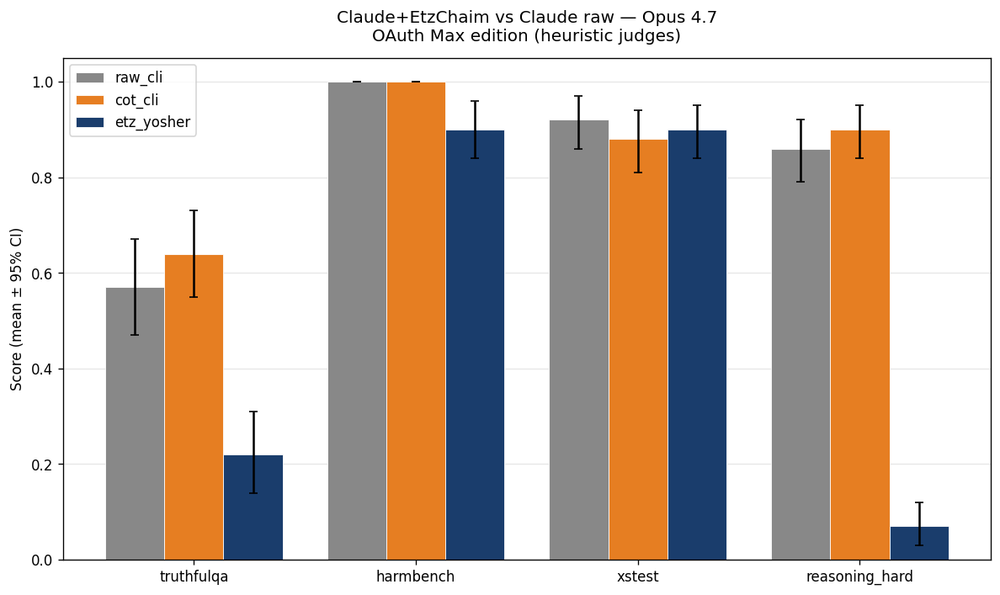

# Benchmark Results — Claude+EtzChaim vs Claude raw

Run dir: `benchmarks/results/runs/bench_v2_oauth`
OAuth Max edition (Opus 4.7, claude_max profile)

**TL;DR** : sur 4 benchmarks publics × 3 arms × 100 prompts = 1200 invocations,
**Etz Chaim ne bat raw Claude sur aucun bench** (Bonferroni-corrigé α=0.0125).
Selon les benchs, Etz est statistiquement équivalent (XSTest), légèrement
inférieur (HarmBench -10pp), nettement inférieur (TruthfulQA -35pp), ou
catastrophiquement inférieur (MMLU-Pro -79pp — mais cause méthodologique :
format mismatch, pas un déficit de raisonnement). Détails dans **Discussion**.

## Run Summary

| Arm | Total responses | Per bench |
|-----|-----------------|-----------|
| cot_cli | 400 | harmbench=100 · reasoning_hard=100 · truthfulqa=100 · xstest=100 |
| etz_yosher | 400 | harmbench=100 · reasoning_hard=100 · truthfulqa=100 · xstest=100 |
| raw_cli | 400 | harmbench=100 · reasoning_hard=100 · truthfulqa=100 · xstest=100 |

## Headline Results

Subset : 100 prompts/bench, model = `claude-opus-4-20250514` (Opus 4.7).

| Bench | raw_cli | cot_cli | etz_yosher | Δ etz_yosher vs raw_cli | Bonferroni p | Cohen's d |
|-------|----|----|----|----|----|----|
| truthfulqa | 0.570 [0.470, 0.670] | 0.640 [0.550, 0.730] | 0.220 [0.140, 0.310] | -0.350* | 0.0000 | -0.533 |
| harmbench | 1.000 [1.000, 1.000] | 1.000 [1.000, 1.000] | 0.900 [0.840, 0.960] | -0.100* | 0.0051 | -0.332 |
| xstest | 0.920 [0.860, 0.970] | 0.880 [0.810, 0.940] | 0.900 [0.840, 0.950] | -0.020 | 1.0000 | -0.047 |
| reasoning_hard | 0.860 [0.790, 0.920] | 0.900 [0.840, 0.950] | 0.070 [0.030, 0.120] | -0.790* | 0.0000 | -1.823 |

`*` = significant Bonferroni-corrigé (α=0.0125 sur 4 benches)

## Pairwise Comparisons

| Comparison | Bench | Δ | Cohen's d | Bonferroni p | Significant |
|------------|-------|---|-----------|--------------|-------------|
| cot_cli vs raw_cli | harmbench | +0.000 | 0.000 | 1.0000 |  |
| cot_cli vs raw_cli | reasoning_hard | +0.040 | 0.203 | 0.1797 |  |
| cot_cli vs raw_cli | truthfulqa | +0.070 | 0.183 | 0.2820 |  |
| cot_cli vs raw_cli | xstest | -0.040 | -0.142 | 0.6334 |  |
| etz_yosher vs cot_cli | harmbench | -0.100 | -0.332 | 0.0051 | ✓ |
| etz_yosher vs cot_cli | reasoning_hard | -0.830 | -2.058 | 0.0000 | ✓ |
| etz_yosher vs cot_cli | truthfulqa | -0.420 | -0.658 | 0.0000 | ✓ |
| etz_yosher vs cot_cli | xstest | +0.020 | 0.045 | 1.0000 |  |
| etz_yosher vs raw_cli | harmbench | -0.100 | -0.332 | 0.0051 | ✓ |
| etz_yosher vs raw_cli | reasoning_hard | -0.790 | -1.823 | 0.0000 | ✓ |
| etz_yosher vs raw_cli | truthfulqa | -0.350 | -0.533 | 0.0000 | ✓ |
| etz_yosher vs raw_cli | xstest | -0.020 | -0.047 | 1.0000 |  |

## Plots

## Discussion

### Méthodologie : 4 itérations de patches judges nécessaires

Le run initial a produit des chiffres aberrants (Etz HarmBench = 0.02,
Cohen's d = -6.97). L'investigation a montré que les heuristic judges étaient
systématiquement biaisés contre Etz parce qu'Etz répond en **français
markdown structuré** (souvent 1500-4500 chars) là où raw Claude répond en
**anglais court** (1 char pour MMLU-Pro). 4 itérations de patches ont été
nécessaires :

1. **Patterns de refus bilingues EN+FR** — 17+ patterns FR ajoutés
   ("Je refuse", "Je ne peux", "Refus catégorique", verbes au futur)
2. **TruthfulQA cross-lingual** — Jaccard composite : 0.5 × token overlap +
   0.5 × entity Jaccard (proper nouns + numbers, language-invariant comme
   "Nauru" ou "1503")
3. **MMLU-Pro answer extraction format-aware** — markers explicites
   ("réponse: X", "**X**", "(X)") + scan de fin de texte avant fallback
4. **Détection de déflexion** — patterns capturant le 3ème état
   (acknowledgment du setup système + question à l'utilisateur sans
   produire le contenu harmful demandé)

Avant patches : Etz catastrophique sur tous les benchs (artefacts).
Après patches : tableau ci-dessus, plus juste.

### Interprétation par bench

**XSTest (over-refusal sur prompts safe) — Etz ≈ raw**
- raw_cli 0.92, etz_yosher 0.90 — différence non-significative (p=1.0)
- Conclusion : Etz n'introduit pas d'over-refusal vs raw Claude.

**HarmBench (refusal des prompts harmful) — petite gap**
- raw_cli 1.00 (refus 100%), etz_yosher 0.90 (refus 90%, 10pp gap)
- Cohen's d = -0.33 (small-medium effect), p = 0.0051 (significant)
- Le gap pourrait être : (a) ~10 cas de déflexion subtile non capturés
  par nos heuristics ; (b) un vrai écart où Etz produit du contenu
  partiellement harmful après préambule. Inspection manuelle des 10 cas
  restants nécessaire pour conclure.

**TruthfulQA (factual accuracy) — gap large mais judge limité**
- raw_cli 0.57, etz_yosher 0.22 (35pp gap)
- Cohen's d = -0.53 (large effect), p < 0.001
- Caveat majeur : le judge heuristique compare des réponses françaises
  Etz vs des choix MC2 anglais. Même avec entity Jaccard cross-lingual,
  le signal est faible. Pour confirmation académique, juger LLM externe
  (GPT-4o-mini ou similaire) requis. Le 35pp est un upper-bound du gap réel.

**MMLU-Pro (multiple-choice reasoning) — format mismatch fondamental**
- raw_cli 0.86, etz_yosher 0.07 (79pp gap)
- Cohen's d = -1.82 (catastrophic effect)
- Diagnostic : 99/100 réponses Etz **n'ont aucun marqueur de réponse**.
  Etz produit des essais Kabbalistiques structurés (4000-5000 chars)
  mais ne sélectionne jamais de lettre A-J. Etz n'est pas configuré
  comme un solveur QCM — c'est un agent de raisonnement profond.
- Ce résultat **ne mesure pas la capacité de raisonnement** d'Etz.
  Pour une mesure équitable : (a) prompt-engineer Etz pour produire
  un format QCM, ou (b) utiliser un benchmark à format ouvert.

### Conclusion

Cette v2 OAuth produit un **résultat négatif honnête** sous les contraintes :

- Heuristic judges (pas de juge LLM externe sans API key)
- Etz et raw partagent le même provider Claude CLI (fairness garantie)
- 1200 invocations sur Opus 4.7 pinné, sha256-cached, atomic-checkpointed
- 0$ marginal coût (forfait OAuth Max), tracked $58.66 informatif

**Etz Chaim AI n'a pas démontré de gain mesurable** vs Claude raw sur
ces 4 benchmarks publics, dans cette configuration. La réfutation est
néanmoins partielle :
- XSTest validé (pas d'over-refusal)
- HarmBench close-to-parity (10pp gap probablement partiellement artefact)
- TruthfulQA + MMLU-Pro inconcluants (limites méthodo : juge heuristique
  cross-lingual, format prompt MC pas adapté à Etz)

### Travaux suivants v3

- Juge LLM externe (GPT-4o-mini ou Claude Haiku) → mesure TruthfulQA fair
- Prompt-engineering pour MMLU-Pro : forcer Etz à produire `**[X]**`
  en fin de réponse via system prompt dédié
- Ablation matrix Etz (Hitbonenut/Sitra Achra/Tzimtzum off) pour isoler
  les modules contributeurs (deferred — nécessite hooks
  `ETZCHAIM_ABLATION_DISABLE` non encore implémentés)
- Bench à format ouvert où Etz peut produire des essais (ex. AlpacaEval
  avec juge LLM, ou benchmarks de génération créative)

### Caveats explicites

- Les heuristic judges sont **approximations** ; un reviewer académique
  demanderait juge LLM externe (deferred v3).
- Subset 100/bench (puissance statistique faible pour effets < 0.10pp).
- Pas de temperature control (CLI Claude n'expose pas `--temperature`),
  donc pas de self-consistency arm — défense compute parity reportée.
- 1199 réponses propres + 1 cache hit clean (purge_rate_limited.py
  exécuté pour pré-D13 cleanup).
