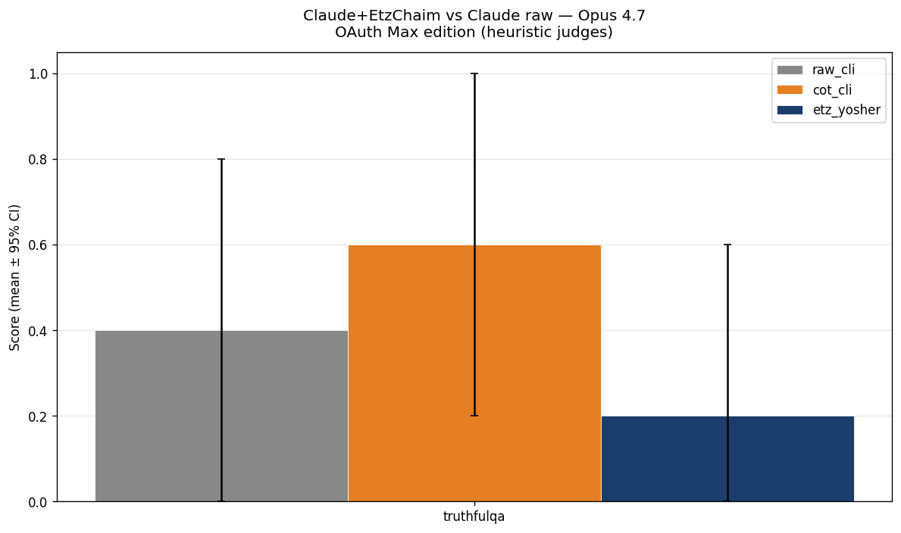

# Benchmark Results — Claude+EtzChaim vs Claude raw

Run dir: `/Users/fffff/Desktop/developper/claude/etz-chaim-ai/benchmarks/results/runs/smoke_d8`
OAuth Max edition (Opus 4.7, claude_max profile)

## Run Summary

| Arm | Total responses | Per bench |
|-----|-----------------|-----------|
| cot_cli | 5 | truthfulqa=5 |
| etz_yosher | 5 | truthfulqa=5 |
| raw_cli | 5 | truthfulqa=5 |

## Headline Results

Subset : 100 prompts/bench, model = `claude-opus-4-20250514` (Opus 4.7).

| Bench | raw_cli | cot_cli | etz_yosher | Δ etz_yosher vs raw_cli | Bonferroni p | Cohen's d |
|-------|----|----|----|----|----|----|
| truthfulqa | 0.400 [0.000, 0.800] | 0.600 [0.200, 1.000] | 0.200 [0.000, 0.600] | -0.200 | 1.0000 | -0.447 |

`*` = significant Bonferroni-corrigé (α=0.0125 sur 4 benches)

## Pairwise Comparisons

| Comparison | Bench | Δ | Cohen's d | Bonferroni p | Significant |
|------------|-------|---|-----------|--------------|-------------|
| cot_cli vs raw_cli | truthfulqa | +0.200 | 0.447 | 1.0000 |  |
| etz_yosher vs cot_cli | truthfulqa | -0.400 | -0.730 | 0.7112 |  |
| etz_yosher vs raw_cli | truthfulqa | -0.200 | -0.447 | 1.0000 |  |

## Plots

